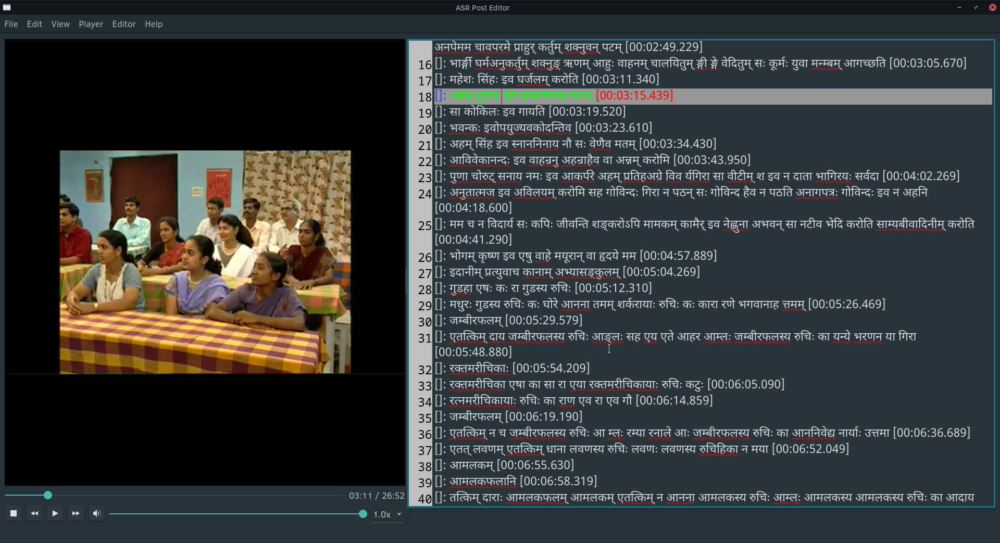

# ASR Post Editor

This tool facilitates editing transcripts that are generated by ASR (Auto Speech Recognition)
model.

## Build

To build the tool you'll need a few things to get started

1. Qt 5 installed on your system with base and multimedia packages.
2. Codec support for media playback (different for different operating systems).
3. A C++ compiler corresponding to the Qt toolchain that you installed.
4. Cmake to build the project.

### Notes:
* Make sure cmake can find Qt5 multimedia package cmake lists file.   
* Clone the repo or download as zip
* Qt creator can be used to skip steps below and build the tool
```shell
git clone https://github.com/jatindalal/asr-post-editor
cd asr-post-editor

# The '-j flag' will help building the tool faster
# by using more than one job to build but 'can be ignored'
# This number is usually set equal to the number of virtual 
# cores your system contains

cmake . -B build -j <no of jobs>
cmake --build build
```

## Sample Video and Transcript
[Drive link](https://drive.google.com/drive/folders/1TTc0giy8rkz8hfXviKW2W90XpxDBISF7?usp=sharing)
## Screenshot
